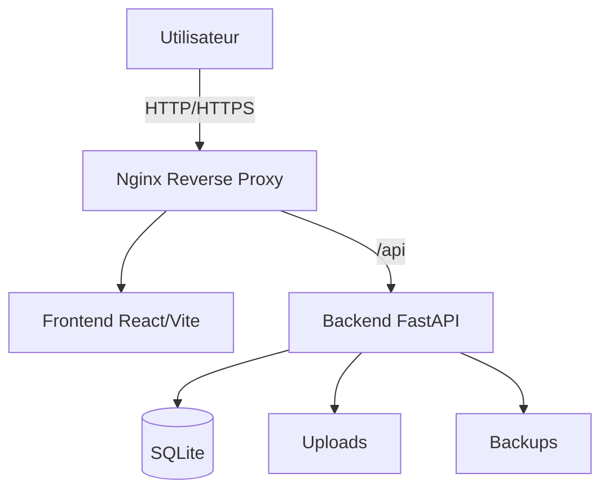
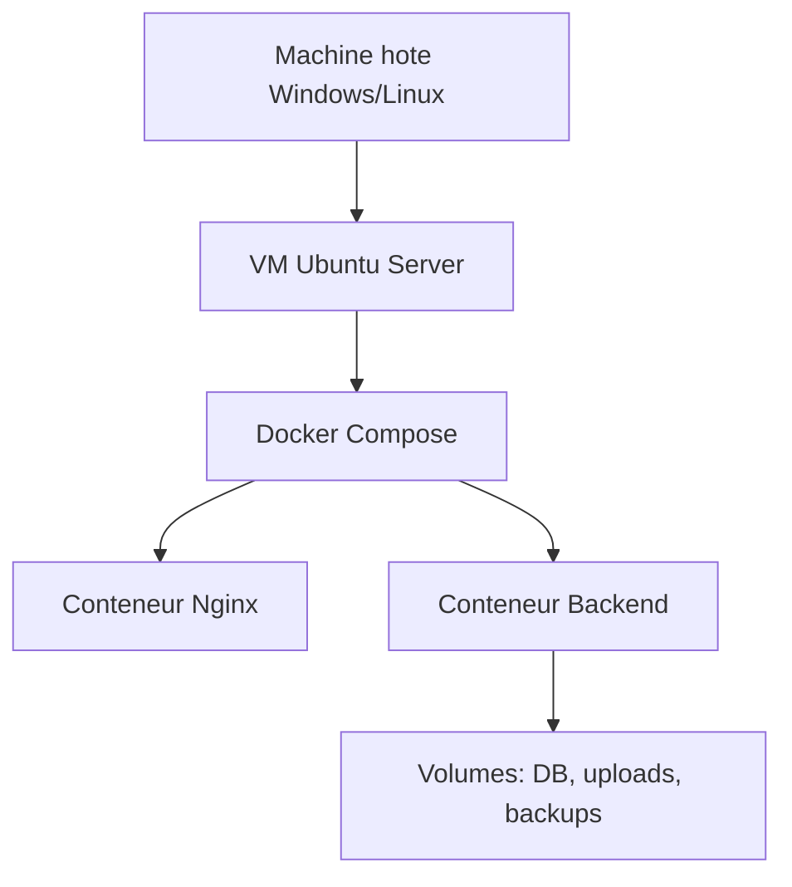
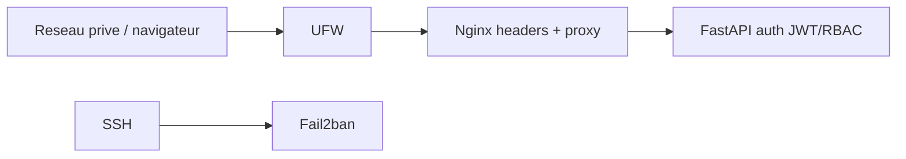
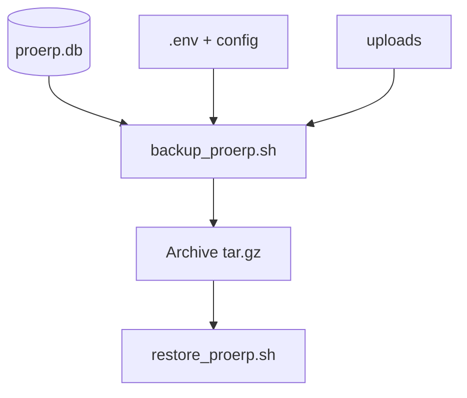
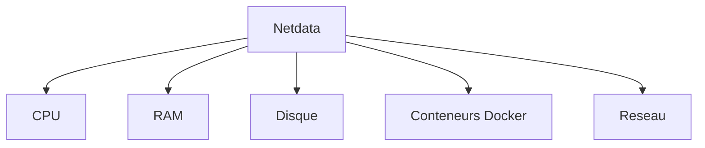

# Architecture SecureERP Cloud

## Architecture globale

```mermaid
flowchart TD
  U[Utilisateur] -->|HTTP/HTTPS| N[Nginx Reverse Proxy]
  N --> F[Frontend React/Vite]
  N -->|/api| B[Backend FastAPI]
  B --> D[(SQLite)]
  B --> UP[Uploads]
  B --> BK[Backups]
```

## Architecture de deploiement

```mermaid
flowchart TD
  H[Machine hote Windows/Linux] --> VM[VM Ubuntu Server]
  VM --> DOCKER[Docker Compose]
  DOCKER --> NGINX[Conteneur Nginx]
  DOCKER --> API[Conteneur Backend]
  API --> DATA[Volumes: DB, uploads, backups]
```

## Architecture securite

```mermaid
flowchart LR
  Internet[Reseau prive / navigateur] --> UFW[UFW]
  UFW --> NGINX[Nginx headers + proxy]
  NGINX --> API[FastAPI auth JWT/RBAC]
  SSH[SSH] --> F2B[Fail2ban]
```

## Architecture sauvegarde

```mermaid
flowchart TD
  DB[(proerp.db)] --> SCRIPT[backup_proerp.sh]
  CFG[.env + config] --> SCRIPT
  UP[uploads] --> SCRIPT
  SCRIPT --> ARCH[Archive tar.gz]
  ARCH --> RESTORE[restore_proerp.sh]
```

## Architecture monitoring

```mermaid
flowchart TD
  NET[Netdata] --> CPU[CPU]
  NET --> RAM[RAM]
  NET --> DISK[Disque]
  NET --> DOCKER[Conteneurs Docker]
  NET --> NETW[Reseau]
```
