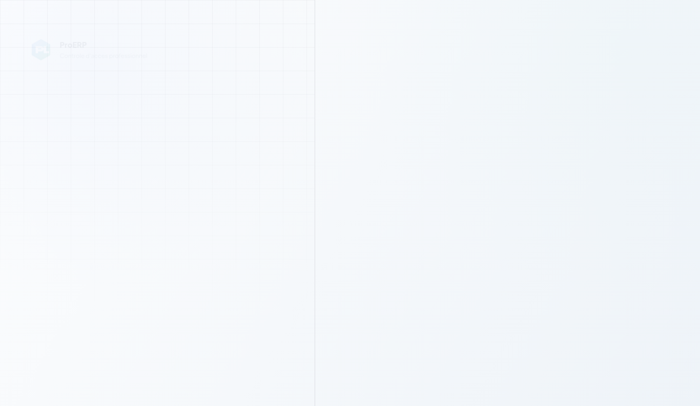
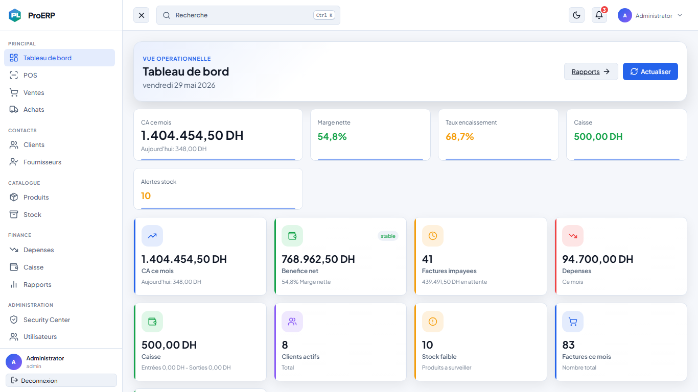
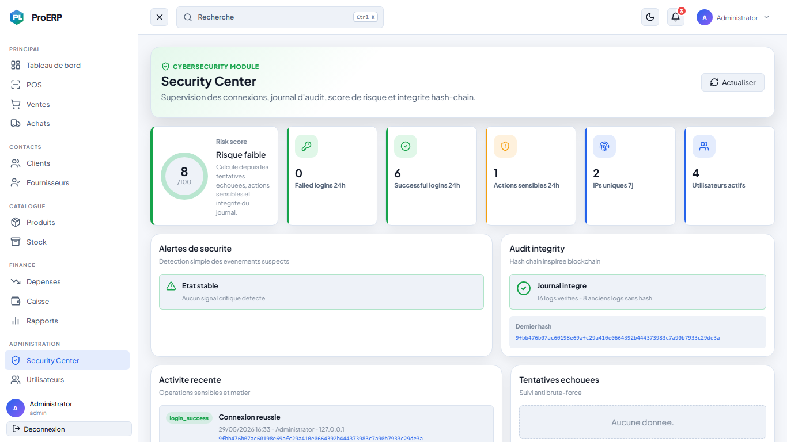
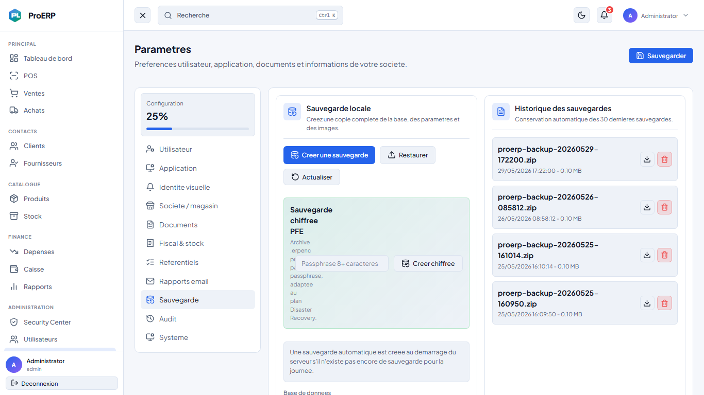
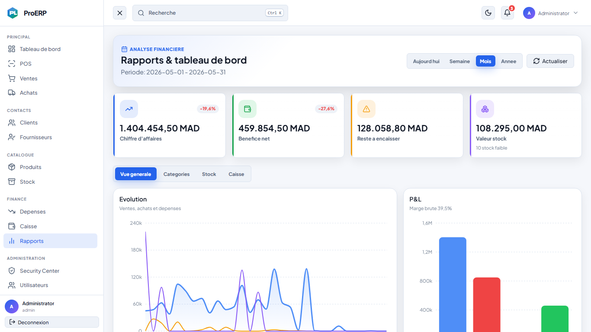
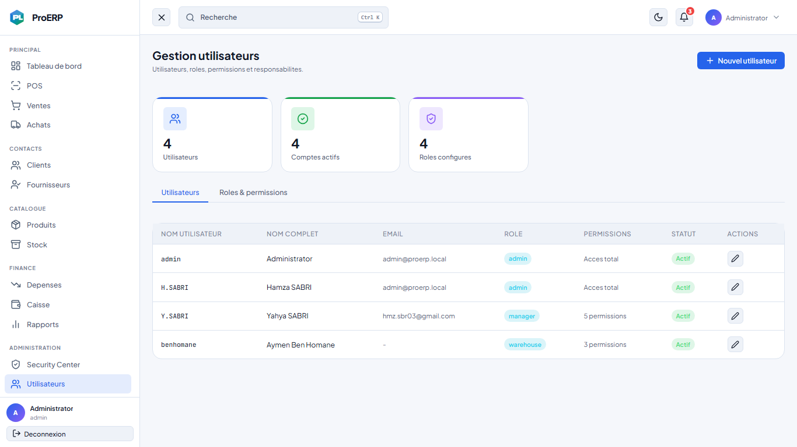
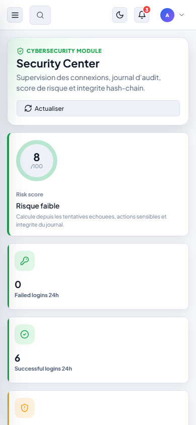

# Index des captures d'ecran PFE

Les captures sont stockees dans:

```text
docs/screenshots
```

## 01-login.png



Role dans le PFE:

- Montre le point d'entree de l'application.
- Permet d'expliquer l'authentification.
- Les connexions reussies et echouees sont journalisees.

## 02-dashboard.png



Role dans le PFE:

- Montre la partie ERP operationnelle.
- Sert a prouver que la solution n'est pas seulement un module securite, mais une application de gestion complete.

## 03-security-center.png



Role dans le PFE:

- Capture principale du module cybersécurite.
- Montre risk score, alertes, integrity et logs.

## 04-backup-chiffre.png



Role dans le PFE:

- Montre le module Backup & Disaster Recovery.
- Prouve l'ajout de la sauvegarde chiffree `.erpenc`.

## 05-reports.png



Role dans le PFE:

- Montre le reporting ERP.
- Peut etre utilisee pour expliquer la supervision metier.

## 06-users-roles.png



Role dans le PFE:

- Montre RBAC.
- Explique utilisateurs, roles et permissions.

## 07-security-mobile.png



Role dans le PFE:

- Montre le responsive design.
- Utile pour prouver que le Security Center reste exploitable sur smartphone.
